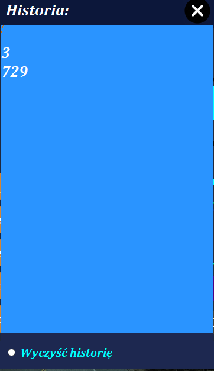

# KalkulatorNaukowyCsharp
Kalkulator naukowy z funkcją rysowania wykresów
# Opis: Aplikacja napisana przy użyciu techonologi winForms.
## Aplikacja posiada funkcję rysowania wykresów (możliwa zmiana precyzji i zakresu).
## Zawiera również historię wykonywanych operacji.

## Przycisk widok:

## Przykładowe użycie kalkulatora, zamiany temeratury oraz obliczania wielokrotności:

## Historia:

## Rysowanie funkcji wielomianu:

## Rysowanie funkcji kwadratowej:

## Rysowanie funkcji trygonometrycznych:

